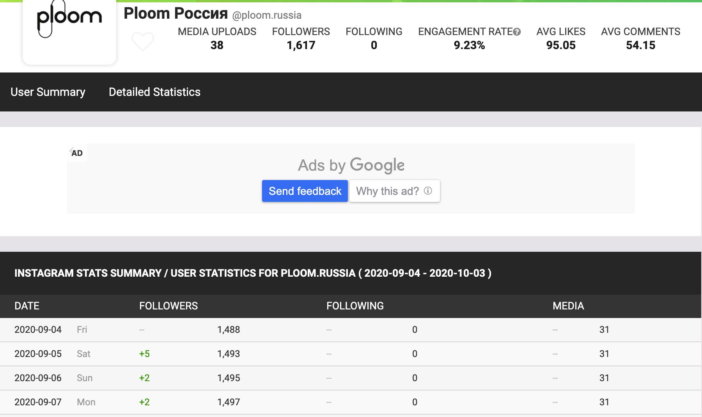

# SocialBlade Chrome Extension

SocialBlade Chrome Extension that allow parsing table with Instagram ot Youtube stats table from:
    
    http://socialblade.com.ru

# Example
Extension convert data from table:

 

To JSON format:
```json
{
  "history": [
    {
      "brand": "ploom",
      "comments": 54.15,
      "date": 1599177600,
      "engagement": 9.23,
      "handle": "@ploom.russia",
      "likes": 95.05,
      "mediaUploads": 31,
      "source": "instagram",
      "followers": 1488,
      "type": "history"
    },
    {
      "brand": "ploom",
      "comments": 54.15,
      "date": 1599264000,
      "engagement": 9.23,
      "handle": "@ploom.russia",
      "likes": 95.05,
      "mediaUploads": 31,
      "source": "instagram",
      "followers": 1493,
      "type": "history"
    },
    {
      "brand": "ploom",
      "comments": 54.15,
      "date": 1599350400,
      "engagement": 9.23,
      "handle": "@ploom.russia",
      "likes": 95.05,
      "mediaUploads": 31,
      "source": "instagram",
      "followers": 1495,
      "type": "history"
    },
    {
      "brand": "ploom",
      "comments": 54.15,
      "date": 1599436800,
      "engagement": 9.23,
      "handle": "@ploom.russia",
      "likes": 95.05,
      "mediaUploads": null,
      "source": "instagram",
      "followers": 1497,
      "type": "history"
    }
  ],
  "statSummary": {
    "date": 1601683200,
    "followers": 1617,
    "media": 38
  }
}
```

All data stored in exchange buffer. Just paste it anywhere.
